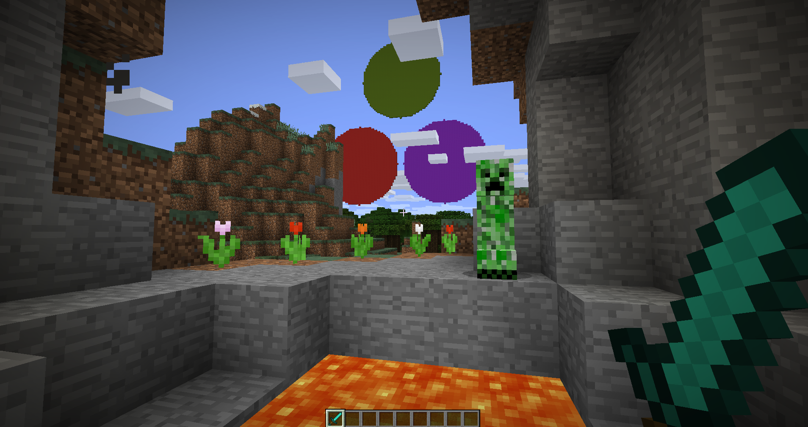

# PiCraft



### Control a Minecraft world on the Minecraft: Pi or Java edition from Julia

PiCraft is a Julia package which allows control over the Minecraft World using code. It is compatible with the Minecraft: Pi Edition and the Java Edition with the help of RaspberryJamMod or RaspberryJuice.

With this package you will be able to :

- Write scripts to teleport and walk over Water and Lava.
- Construct multi-storey skyscrapers within seconds.
- Draw fractals and shapes using a 3-D turtle.
- Import and export `.schematic` models without external software.

The above examples and more is in the documentation which can be accessed
[here]( https://juliaberry.github.io/PiCraft.jl/).

## Installation and Usage

### Get Minecraft

- The Minecraft: Pi edition is pre-installed on all Rasbian since September 2014. Launch it by navigating to **Menu** > **Games** or typing **minecraft-pi** in the terminal. However, if you are running an older version of Raspbian get it [here](https://minecraft.net/en-us/edition/pi/).
- Get the Minecraft: Java edition(MacOS, Linux and Windows) [here](https://minecraft.net/en-us/download/alternative).

### Get RaspberryJuice or RaspberryJamMod (for Minecraft: Java edition)

Officially the ability to communicate with the Minecraft world is only available for the Minecraft: Pi edition. To get this to work on the Java edition we need to install a Mod.

- "RaspberryJamMod" is a Forge Mod, if you wish to use this along with other Forge mods then this is recommended. Installation instructions are available [here](http://www.instructables.com/id/Python-coding-for-Minecraft/).
- "RaspberryJuice" is a Bukkit server plugin, recommended if you wish to work on a Bukkit Minecraft server. Get it [here](https://dev.bukkit.org/projects/raspberryjuice).

### Get Julia

Download the appropriate Julia version for your system from [here](https://julialang.org/downloads/). If you are on a raspberry pi you should follow the instructions
given in the documentation [here](https://juliaberry.github.io/PiCraft.jl/installation/#Install-Julia-1).

### Install the PiCraft package

```julia
using Pkg
Pkg.add("https://github.com/JuliaBerry/PiCraft.jl")
```

### Documentation

Documentation for this package can be accessed at https://juliaberry.github.io/PiCraft.jl/
The documentation consists of a setup instructions, basic tutorials, examples and
reference pages.

## Quick Start Guide

Load the `PiCraft` package on the Julia console:
```julia
using PiCraft
```

On load, the library will attempt to connect to a running Minecraft world on `localhost`. If Minecraft is not running, an error message will be printed. Subsequently, once Minecraft has been started, a connection can be forced by calling `connectToWorld()`.

A 3-D coordinate system is used to describe the Minecraft world. Every position in the Minecraft World can be described with the help of 3 numbers. The X, Y and Z coordinates. These coordinates can be viewed by opening the Debug screen pressing the `F3` key.


### Player
You can find and set your player's location:
1) Find Player position: `getPos()`
      * Returns a `Tuple{Float64, Float64, Float64}` which contains the player's current coordinates.
2) Set Player position: `setPos(pos::Tuple{Float64, Float64, Float64})`
      * Teleports the player to the specified coordinates.

For example : `setPos(getPos() .+ (0, 10, 0))` will teleport you 10m above you current position.

### Blocks
Blocks are the heart of Minecraft. The package provides the ability to modify blocks at specified coordinates.
`Block` is an immutable datatype defined in `src/blocks.jl`.

```julia
struct Block
    id::Int
    data::Int
end
```
The `id` defines the type of block (like cobblestone, wool, wood,.etc) and the `data` attribute defines additional characteristics of the block, on default every block has it `data` set to `0`. For example, Wool's block id is 35, `Block(35,0)` refers to a block of white wool. Different wool colors can be accessed by changing the `data` attribute. Red Wool is `Block(35, 14)`, Pink Wool is `Block(35,6)` and so on. A complete reference can be found [here](https://juliaberry.github.io/PiCraft.jl/blocks.html) in the documentation.

1) Place Block: `setBlock(Tuple{Int, Int, Int}, block::Block)`
    * Place the specified Block at the specified coordinates.
2) Place Blocks: `setBlocks(p1::Tuple{Real, Real, Real}, p2::Tuple{Real, Real, Real}, block::Block)`
    * Set an entire region to the specified block type defined by corners.
3) Get Block information: `getBlock(Tuple{Int,Int,Int})`
    * Returns the block present at the specified coordinates.

While the `getBlock` and `setBlock` functions will accept `Float64` as arguments these will be rounded and set to `Int` as a block cannot be placed on non-integer coordinates.

### Contributing

Contributions and bug reports are welcome! If you want to share some of your work,
have a query or an example to share you can post on the #PiCraft channel on
julialang's [slack](https://julialang.slack.com) or open an issue on the
PiCraft [github page](https://github.com/JuliaBerry/PiCraft.jl/issues) directly.
