# Block Reference

Id  |Name|Subtype|Image|Data
|---|-----|-------|-----|---
| 0 | Air |  |  | 0 |
| 1 | Stone |  |  | 0 |
| 2 | Grass |  |  | 0 |
| 3 | Dirt |  |  | 0 |
| 4 | Cobblestone |  | 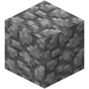 | 0 |
| 5 | Wood Plank | Oak |  | 1 |
|  |  | Spruce | 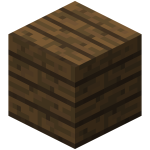 | 2 |
|  |  | Birch | 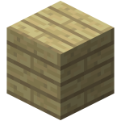 | 3 |
|  |  | Jungle |  | 4 |
| 6 | Sapling | Oak |  | 0 |
|  | Sapling | Spruce |  | 1 |
|  | Sapling | Birch |  | 2 |
|  | Sapling | Jungle |  | 3 |
| 7 | Bedrock |  |  | 0 |
| 8 | Water(Flowing) |  |  | 0 |
| 9 | Water(Stationary) | High |  | 0 |
|  | Water(Stationary) | Low |  | 7 |
| 10 | Lava(Flowing) |  |  | 0 |
| 11 | Lava(Stationary) | High |  | 0 |
| 11 | Lava(Stationary) | Low |  | 7 |
| 12 | Sand |  |  | 0 |
| 13 | Gravel |  |  | 0 |
| 14 | Gold Ore |  |  | 0 |
| 15 | Iron Ore |  |  | 0 |
| 16 | Coal Ore |  |  | 0 |
| 17 | Wood | Oak(up/down) |  | 0 |
|  |  | Spruce(up/down) | 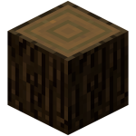 | 1 |
|  |  | Birch(up/down) |  | 2 |
|  |  | Jungle(up/down) |  | 3 |
|  |  | Oak(east/west) | | 4 |
|  |  | Spruce(east/west) |  | 5 |
|  |  | Birch(east/west) |  | 6 |
|  |  | Jungle(east/west) |  | 7 |
|  |  | Oak(north/south) |  | 8 |
|  |  | Spruce(north/south) |  | 9 |
|  |  | Birch(north/south) |  | 10 |
|  |  | Jungle(north/south) |  | 11 |
|  |  | Oak(only bark) |  | 12 |
|  |  | Spruce(only bark) |  | 13 |
|  |  | Birch(only bark) |  | 14 |
|  |  | Jungle(only bark) |  | 15 |
| 18 | Leaves | Oak |  | 1 |
|  |  | Spruce |  | 2 |
|  |  | Birch |  | 3 |
| 19 | Glass |  |  | 0 |
| 21 | Lapis Lazuli Ore |  |  | 0 |
| 22 | Lapis Lazuli Block |  |  | 0 |
| 24 | Sandstone | Ordinary |  | 0 |
|  |  | Chiselled |  | 1 |
|  |  | Smooth |  | 2 |
| 26 | Bed |  | 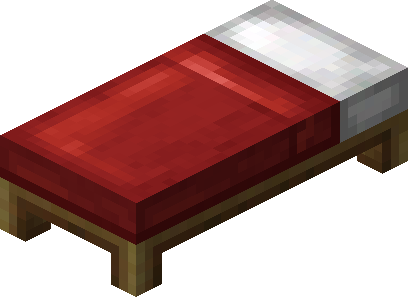 | 0 |
| 30 | Cobweb |  |  | 0 |
| 31 | Grass(tall) | Shrub | 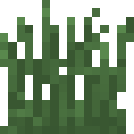 | 0 |
|  |  | Grass |  | 1 |
|  |  | Fern |  | 2 |
|  |  | Grass(color by biome) |  | 3 |
| 35 | Wool | White |  | 0 |
|  |  | Orange |  | 1 |
|  |  | Magenta |  | 2 |
|  |  | Light Blue |  | 3 |
|  |  | Yellow |  | 4 |
|  |  | Lime |  | 5 |
|  |  | Pink |  | 6 |
|  |  | Grey |  | 7 |
|  |  | Light Grey |  | 8 |
|  |  | Cyan |  | 9 |
|  |  | Purple |  | 10 |
|  |  | Blue |  | 11 |
|  |  | Brown | 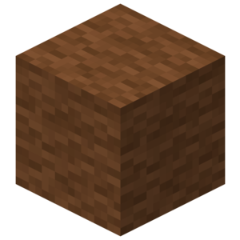 | 12 |
|  |  | Green | 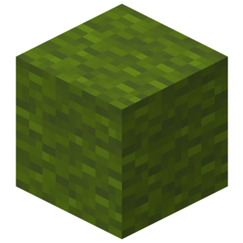 | 13 |
|  |  | Red |  | 14 |
|  |  | Black | 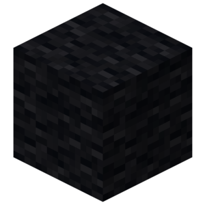 | 15 |
| 37 | Yellow Flower(dandelion) |  |  | 0 |
| 38 | Cyan Flower |  |  | 0 |
| 39 | Brown Mushroom |  |  | 0 |
| 40 | Red Mushroom |  |  | 0 |
| 41 | Gold Block |  |  | 0 |
| 42 | Iron Block |  |  | 0 |
| 43 | Double Slab | Stone |  | 0 |
|  |  | Sandstone |  | 1 |
|  |  | Wooden |  | 2 |
|  |  | Cobblestone |  | 3 |
|  |  | Brick |  | 4 |
|  |  | Stone Brick |  | 5 |
|  |  | Nether Brick |  | 6 |
|  |  | Quartz |  | 7 |
| 44 | Single Slab | Stone |  | 0 |
|  |  | Sandstone |  | 1 |
|  |  | Wooden |  | 2 |
|  |  | Cobblestone |  | 3 |
|  |  | Brick | 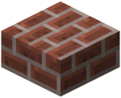 | 4 |
|  |  | Stone Brick |  | 5 |
|  |  | Nether Brick | 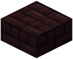 | 6 |
|  |  | Quartz |  | 7 |
| 45 | Brick Block |  |  | 0 |
| 46 | TNT | Inactive |  | 0 |
|  |  | Ready to explode |  | 1 |
| 47 | Bookshelf |  |  | 0 |
| 48 | Moss Stone |  |  | 0 |
| 49 | Obsidian |  |  |0 |
| 50 | Torch | On floor |  | 0 |
|  |  | Pointing East | | 1 |
|  |  | Pointing West |  | 2 |
|  |  | Pointing South |  | 3 |
|  |  | Pointing North |  | 4 |
| 51 | Fire |  |  | 0 |
| 53 | Stair Wood | Ascending east |  | 0 |
|  |  | Ascending west |  | 1 |
|  |  | Ascending south |  | 2 |
|  |  | Ascending north |  | 3 |
|  |  | Ascending east(upside down) |  | 4 |
|  |  | Ascending west(upside down) |  | 5 |
|  |  | Ascending south(upside down) |  | 6 |
|  |  | Ascending north(upside down) |  | 7 |
| 54 | Chest | Facing north |  | 2 |
|  |  | Facing south |  | 3 |
|  |  | Facing west |  | 4 |
|  |  | Facing east |  | 5 |
| 56 | Diamond Ore |  | 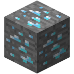 | 0 |
| 57 | Diamond Block |  |  |0
| 58 | Crafting Table |  |  |0
| 60 | Farmland |  |  |0
| 61 | Furnace(Inactive) | Facing north |  | 2
|  |  | Facing south |  | 3 |
|  |  | Facing west | | 4 |
|  |  | Facing east |  | 5 |
| 62 | Furnace(Active) | Facing north | .png) | 2 |
|  |  | Facing south |  | 3 |
|  |  | Facing west | | 4 |
|  |  | Facing east |  | 5 |
| 64 | Wooden Door |  |  | 0 |
| 65 | Ladder | Facing north |  | 2 |
|  |  | Facing south |  | 3 |
|  |  | Facing west |  | 4 |
|  |  | Facing east |  | 5 |
| 67 | Cobblestone Stairs | Ascending east |  | 0 |
|  |  | Ascending west  |  | 1
|  |  | Ascending south |  | 2
|  |  | Ascending north |  | 3
|  |  | Ascending east(upside down) | 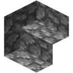 | 4 |
|  |  | Ascending west(upside down) |  | 5 |
|  |  | Ascending south(upside down) |  | 6 |
|  |  | Ascending north(upside down) |  | 7 |
| 71 | Iron Door |  | 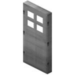 | 0 |
| 73 | Redstone Ore |  |  | 0 |
| 78 | Snow | Lowest | 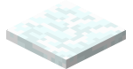 | 0 |
|  |  | Highest |  | 7 |
| 79 | Ice |  |  | 0 |
| 80 | Snow Block |  | .png) | 0 |
| 81 | Cactus |  |  |0
| 82 | Clay |  |  |0
| 83 | Sugarcane |  |  |0
| 85 | Fence |  |  |0
| 89 | Glowstone |  |  |0
| 95 | Bedrock(invisible) |  |  |0
| 98 | Stone Brick | Normal |  | 0 |
|  |  | Mossy  |  | 1 |
|  |  | Cracked  | 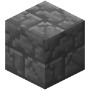 | 2 |
|  |  | Chiseled  | 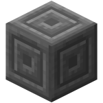 | 3 |
| 102 | Glass Pane |  | 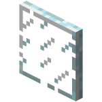 | 0 |
| 103 | Melon |  |  | 0 |
| 107 | Fence Gate |  |  | 0 |
| 246 | Glowing Obsidian |  | 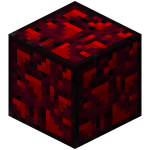 | 0 |
| 247 | Nether Reactor | Unused | 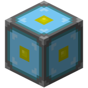 | 0 |
|  |  | Active | .png) | 1 |
|  |  | Stopped/used up | .png) | 2 |
