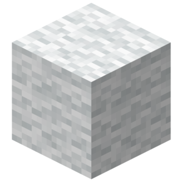
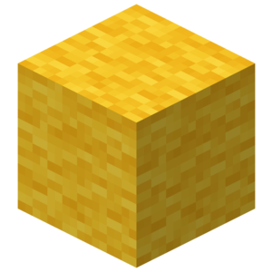
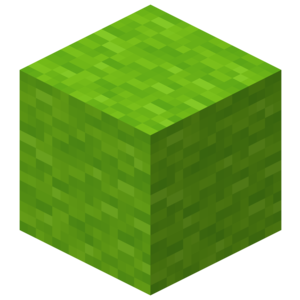
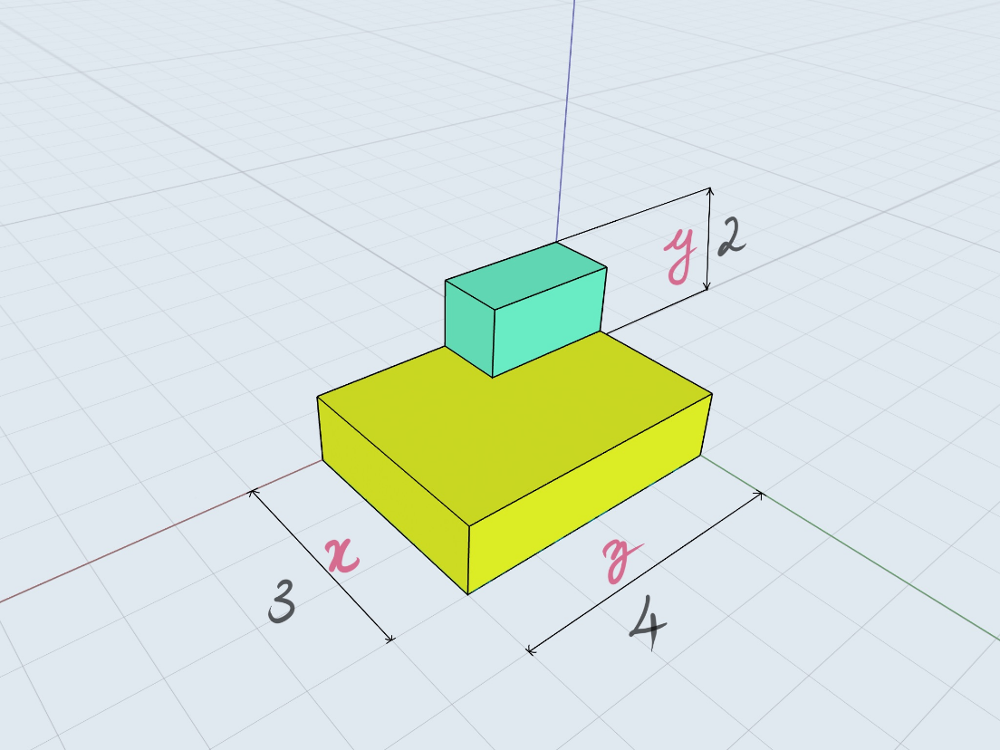

# Blocks and Models

## Blocks

This package provides the ability to modify
blocks at specified coordinates.`Block` is an immutable datatype defined in
`src/blocks.jl`.

```julia
struct Block
    id::Int
    data::Int
end
```
The `id` defines the type of block (like cobblestone, wool, wood,.etc) and the `data`
attribute defines additional characteristics of the block, on default every block
has its `data` set to `0`. For example, Wool's block id is 35, `Block(35,0)` refers
to a block of white wool. Different wool colors can be accessed by changing the `data`
attribute. Red Wool is `Block(35, 14)`, Pink Wool is `Block(35,6)` and so on. A
complete reference can be found in the documentation.

|Id |Name|Subtype|Image|Data|
|---|-----|-------|-----|---|
| 35 | Wool | White |  | 0 |
|  |  | Orange |  | 1 |
|  |  | Magenta |  | 2 |
|  |  | Light Blue |  | 3 |
|  |  | Yellow |  | 4 |
|  |  | Lime |  | 5 |
|  |  | Pink |  | 6 |


1. Place Block: `setBlock(Tuple{Int,Int,Int}, block::Block)`
    * Place the specified `Block` at the specified coordinates.
2. Place Blocks: `setBlocks(p1::Tuple{Real, Real, Real}, p2::Tuple{Real, Real, Real}, block::Block)`
    * Set an entire region to the specified block type defined by the corners `p1` and `p2`.
3. Get Block information: `getBlock(Tuple{Int,Int,Int})`
    * Returns the `Block` present at the specified coordinates.

While `getBlock` and `setBlock` functions will accept any `Real` as arguments
these will be rounded to `Int` as a block cannot be placed on non-integer coordinates.

## Models

The minecraft community has made a large number of fantastic creations over the
years. Models allow us to share, collaborate and improve their
work. Generally, Models are shared in the `.schematic` file format which is a type
of NBT file(Named Binary Type). What we mean by a Model is a 3-Dimensional array
of Blocks(`Array{Block, 3}`). [minecraft-schematics](https://www.minecraft-schematics.com/) and [planetminecraft](https://www.planetminecraft.com/resources/projects/?share=schematic)
 are popular websites which host community provided schematic files. Schematic
 files are the standard way to import and export models using software like
 [MCEdit](http://www.mcedit.net/) and [WorldEdit](https://minecraft.curseforge.com/projects/worldedit).

### Importing `.schmatic` files

 Let's try to import a sample file. It's named `sample.schematic` and located in
 the example folder.

 This is the model we will be importing:
 

 It's composed of gold and diamond blocks as the colors indicate and the coordinate
 axes have been marked.

 The schematic file can be found in the Examples folder or [here](https://raw.githubusercontent.com/JuliaBerry/PiCraft.jl/master/example/sample.schematic)

Copy this file to a convenient location like your desktop or documents folder.
Now to go to this location we can use the Command Prompt/Shell commands.

Enter the `;` character to go into shell mode in a Julia REPL interface. Or you could
also use the `run()` command. For instance to find your current location use
`cd` on Windows and `pwd` on linux/MacOS.

```julia
shell> ls
appveyor.yml  example	  Manifest.toml  README.md  src
docs	      LICENSE.md  Project.toml	 REQUIRE    test

shell> cd ~/Documents
/home/user/Documents

julia> run(`ls`)
sample.nbt
Process(`ls`, ProcessExited(0))

```

Now to import our model use the `importSchematic(filename::AbstractString)` function.

```julia-repl
m = importSchematic("./sample.schematic")
3×2×4 Array{Block,3}:
[:, :, 1] =
 Block(41, 0)  Block(0, 0)
 Block(41, 0)  Block(0, 0)
 Block(41, 0)  Block(0, 0)

[:, :, 2] =
 Block(41, 0)  Block(0, 0)
 Block(41, 0)  Block(0, 0)
 Block(41, 0)  Block(0, 0)

[:, :, 3] =
 Block(41, 0)  Block(0, 0)
 Block(41, 0)  Block(0, 0)
 Block(41, 0)  Block(57, 0)

[:, :, 4] =
 Block(41, 0)  Block(0, 0)
 Block(41, 0)  Block(0, 0)
 Block(41, 0)  Block(57, 0)

```

It would be helpful to try to relate the information above with the illustration
of the model. Notice the indexing is [X, Y, Z]

### Model Functions

Here are the functions you can use with models
 1. `buildModel(m::Array{Block,3}, pos::Tuple{Real, Real, Real})`
 2. `copyModel(p1::Tuple{Real, Real, Real}, p2::Tuple{Real, Real, Real})`
 3. `cutModel(p1::Tuple{Real, Real, Real}, p2::Tuple{Real, Real, Real}, block::Block = Block(0, 0))`
 4. `flip(A::Array{Block, 3}, dim::Symbol)`
 5. `rotate(A::Array{Block, 3}; dir::Symbol = :l, dim::Symbol = :x)`

To build the model:

```julia-repl
julia> pos = getTile()

julia> buildModel(m, pos)

julia> #= This should have build a model, Look in the southeast direction.
          Now to copy the model, we must know it corner's coordinates.      =#
julia> size(m)
(3, 2, 4)

julia> m2 = copyModel(pos .+ (1, 0, 1), pos .+ size(m) .- (0, 1, 0));

julia> m2 == m
true

julia> cutModel(pos .+ (1, 0, 1), pos .+ size(m) .- (0, 1, 0))

julia> # The build model should now me replace by air.
```

Flipping and rotating are operations essential to constructing symmetric structures.

`flip()` can perform a flip in the x-y(:z), y-z(:x) or x-z(:y) plane.
To flip our model upside down we have to flip it in the x-z plane.

```julia-repl
julia> m2 = flip(m, :y)
3×2×4 Array{Block,3}:
[:, :, 1] =
 Block(0, 0)  Block(41, 0)
 Block(0, 0)  Block(41, 0)
 Block(0, 0)  Block(41, 0)

[:, :, 2] =
 Block(0, 0)  Block(41, 0)
 Block(0, 0)  Block(41, 0)
 Block(0, 0)  Block(41, 0)

[:, :, 3] =
 Block(0, 0)   Block(41, 0)
 Block(0, 0)   Block(41, 0)
 Block(57, 0)  Block(41, 0)

[:, :, 4] =
 Block(0, 0)   Block(41, 0)
 Block(0, 0)   Block(41, 0)
 Block(57, 0)  Block(41, 0)

 julia> buildModel(m2, pos)
```
It would be helpful if you try to understand how the Array changes upon a flip.
Similarly try to flip the model in other dimensions and build it to see the changes.
(`flip(m, :x)` & `flip(m, :z)`)

Rotating a model requires two parameters.
    1. The plane in which we will rotate. (dim) (:x, :y, :z)
    2. Direction of rotating.(dir) (:l, :r)

Like flipping `:x` as the dimension indicates a rotation in the y-z plane. And similarly
for other dimensions as well. `:l` indicates a rotation in the counter-clockwise
direction and `:r` indicates a rotation in the clockwise direction when you are
looking in the positive direction of the dimension.

Unlike flipping, a rotation might change the dimension of the model.

Here, a script which shows a rotation animation.

```julia-repl
julia> for i in 1:4
            cutModel(pos .+ (1, 0, 1), pos .+ size(m) .- (0, 1, 0), Block(0,0))
            m = rotate(m, :l, :y)
            buildModel(m, pos)
            sleep(1)
        end
```
Here we build a Model, wait for a second, remove it, rotate it and repeat for 4
times.
