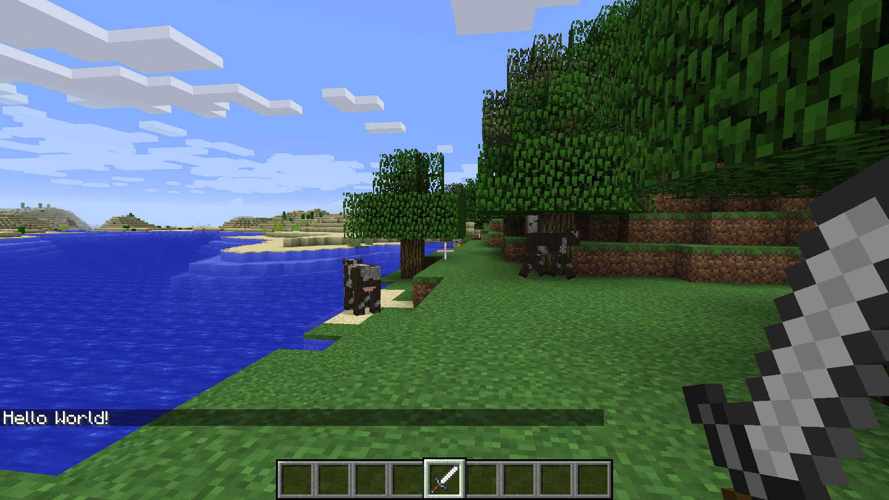

# Load and Connect

1. Launch Minecraft and Julia.
2. If you don't have the PiCraft package then get it by:
```julia
using Pkg
Pkg.add("https://github.com/JuliaBerry/PiCraft.jl")
```
3. Now load the package by:
```julia
using PiCraft
```
4. If you get an error saying "Unable to connect to minecraft world" then
  * Minecraft may not be running. You need to be inside a World not the launch screen/menu.
  * RaspberryJamMod may not be correctly installed
5. If you wish to connect to a instance running on another computer running on your network then:
  * Find the minecraft host's ip address from your router configuration page or by using an appropriate terminal command.
  * Windows: `ipconfig /all`
  * Linux: `hostname -I`
  * MacOS: `ifconfig | grep "inet " | grep -v 127.0.0.1`
6. Connect using the `connectToWorld(address, port = 4711)` function.
7. To check whether everything's working enter `post("Hello World!")` in the julia terminal.
8. You should see "Hello World!" displayed in the minecraft chat.



If you face any issues please open an issue on the PiCraft github or reach us on
the julialang slack's #PiCraft channel.
