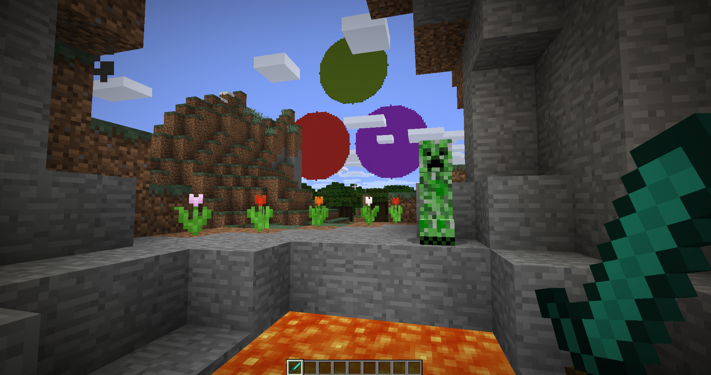

# PiCraft

## Overview

*Control a Minecraft world from Julia*



PiCraft is a Julia package which utilizes the Minecraft: Pi edition programming API to control the Minecraft World. The package can be used with Minecraft: Java Edition with the help of [`RaspberryJamMod`](https://github.com/arpruss/raspberryjammod) & [`RaspberryJuice`](https://dev.bukkit.org/projects/raspberryjuice) plugin.

With this package you will be able to :

- Write scripts to teleport and walk over Water and Lava.
- Construct multi-storey skyscrapers within seconds.
- Draw fractals and shapes using a 3-D turtle.
- Import and export `.schematic` models without external software.  

## Installation

This library requires a working installation of Minecraft on your machine. On the Raspberry Pi, this is the only required dependency. On a PC or Mac, the basic Minecraft install needs to be paired with an unofficial plugin that provides the programmatic API access.

### Get Minecraft

- The Minecraft: Pi edition is pre-installed on all Rasbian since September 2014. Launch it by navigating to `Menu` *>* `Games` or typing `minecraft-pi` in the terminal. However, if you are running an older version of Raspbian get it [here](https://minecraft.net/en-us/edition/pi/).
- Get the Minecraft: Java edition(MacOS, Linux and Windows) [here](https://minecraft.net/en-us/download/alternative).

### Get RaspberryJuice or RaspberryJamMod (for Minecraft: Java edition)

Officially the ability to communicate with the Minecraft world is only available for the Minecraft: Pi edition. To get this to work on the Java edition we need to install a Mod.

- "RaspberryJamMod" is a Forge Mod, if you wish to use this along with other Forge mods then this is recommended. Installation instructions are available [here](http://www.instructables.com/id/Python-coding-for-Minecraft/).
- "RaspberryJuice" is a Bukkit server plugin, recommended if you wish to work on a Bukkit Minecraft server. Get it [here](https://dev.bukkit.org/projects/raspberryjuice).

There is a disagreement in the coordinates reported by Minecraft's debug mode and the `getPos()` command. Enter `/setworldspawn 0 0 0` in the Minecraft console to remove this discrepancy.

### Get Julia

Download the appropriate Julia version for your system from [here](https://julialang.org/downloads/).

### Install the PiCraft packge

```julia
Pkg.clone("https://github.com/JuliaBerry/PiCraft.jl")
```
