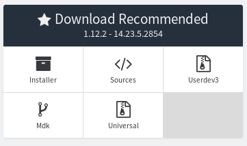
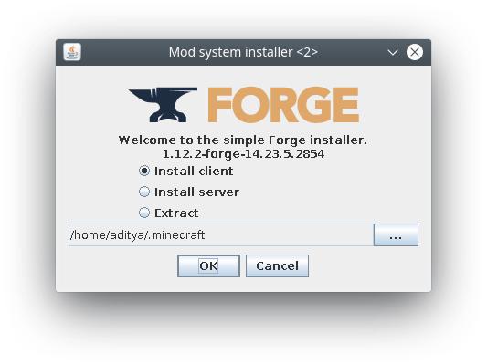
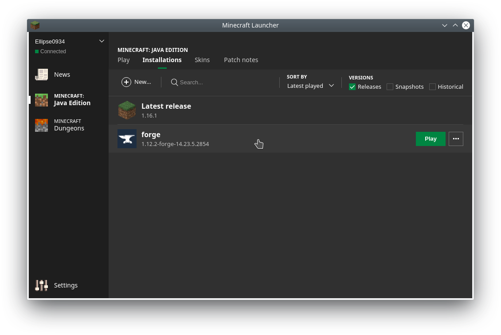

# Installation

## Minecraft: Pi

Minecraft: Pi is free and comes pre-installed on all Rasbian since September 2014.
Launch it by navigating to `Menu` *>* `Games` or typing `minecraft-pi` in the terminal.
However, if you are running an older version of Raspbian get the game [here](https://minecraft.net/en-us/edition/pi/).
Refer to the same link if you are unable to launch it.

Note that Minecraft: Pi is limited compared to the Java version. If you have
a powerful computer and access to a Minecraft: Java license then you should consider
using that platform for a better experience.

## Minecraft: Java

Minecraft: Java can be purchased and downloaded [here](https://minecraft.net).
Follow the installation instructions provided there. The Java edition works on
Windows, Linux and MacOS. However, we will need either RaspberryJamMod or RaspberryJuice
to run `PiCraft`.

### RaspberryJamMod

This is a [forge mod](https://minecraft.gamepedia.com/Mods/Forge). The package is
hosted [here](https://github.com/arpruss/raspberryjammod). The last version of 
RaspberryJamMod is for forge 1.12 so we will need that first. [Download link](http://files.minecraftforge.net/maven/net/minecraftforge/forge/index_1.12.2.html).



Download the installer. The installer requires Java so incase your computer does not recognise it
download the latest version of Java [here](https://www.java.com/en/download/). On windows you 
can directly run the installer, on linux/mac if you can't 

On linux/macOS the installer will be named something like *forge-1.12.2-14.23.4.2749-installer.jar*

To run the installer open the Terminal from Applications and head over to the directory
where the installer is present. Then run it by doing the follows:

```
cd Downloads
java -jar forge-1.12.2-14.23.4.2854-installer.jar
```



Click Install client then click OK.
Upon completion Forge should be installed.

Now we need to install the mod. For this download the [mods.zip](https://github.com/arpruss/raspberryjammod/raw/master/mods.zip)
file from the RaspberryJamMod github page. The `mods.zip` folder consists of many folders, open the folder
1.12.2 and it should contain a single file named `RaspberryJamMod.jar`.

To install the mod we need to extract it to the mods folder in the minecraft directory.
The location for the the *.minecraft* directory for each OS is given below.

|OS |Location|
|:-:|:-------|
|Windows|%APPDATA%\.minecraft|
|macOS|~/Library/Application Support/minecraft|
|Linux|~/.minecraft|

Now head over to this location and create a folder named **mods** if it does not exist.
 Copy the extracted folder `1.12.2`. The mod is now installed.

Next time you launch Minecraft select forge 1.12.2 when starting. This can be done by
going to the installations tab and selecting Forge 1.12.2.



### RaspberryJuice

This is a [Bukkit](https://bukkit.org/) plugin. If you wish to operate a server
with many clients then this is probably the best way to go. You will need to first
setup CraftBukkit and then install the plugin. Refer to the Bukkit Forums and Docs
for instructions and help.

There is also an easy option and that is to grab the Adventures in Minecraft
starter kit for your OS and then run it. Grab the Kit [here](https://adventuresinminecraft.github.io/).
Adventures in Minecraft is a book aimed at kids to teach them programming(python)
using the Minecraft: Pi API. This starter pack is provided by them and is an extremely easy way to setup the environment we need.

## Install Julia

Get the latest stable release of Julia [here](https://julialang.org/downloads/).

For the Raspberry Pi download the `Generic Linux Binaries for ARM`.
We need to extract the tar.gz file then create a symbolic link to julia.
```
cd ~/Downloads
tar -xvf julia-1.0.0-linux-armv7l.tzr.gz
sudo ln -s ~/julia-1.0.0/bin/julia /usr/bin/julia
julia
```
This should launch julia. Whenever you need to open julia open the terminal and
enter julia.

This should install a **REPL shell**. **REPL** stands for Read-Eval-Print-Loop.
This is an interactive shell in which you can run your code(Like Python's IDLE).
While, it is possible to do everything in this shell there are other options to
choose from as an IDE(Integrated Development Environment).

Most popular options are Jupyter Notebooks and Juno.

Juno is built on [Atom](https://atom.io/) and adds Julia-specific enhancements,
such as syntax highlighting, a plot pane, integration with Julia's debugger (Gallium)
, a console for running code, and much more. You can read more about it and get appropriate installation instructions [here](http://junolab.org/).

Juno(and Atom) is a bit resource hungry compared to other editors hence is not recommended
for systems with low specs like the Raspberry Pi. It is recommended that you use
the REPL shell or Jupyter notebook for slower machines.

[Jupyter notebook](http://jupyter.org/) is a web application in which you can
run julia code. You need the `IJulia` package to run Julia from this notebook.
Get IJulia [here](https://github.com/JuliaLang/IJulia.jl). One benefit of using
a Jupyter notebook is that you can run Minecraft in full screen on one computer and use
another computer/tablet's browser to write and execute code for convenience.
