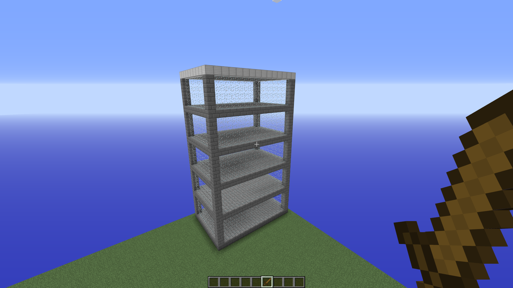
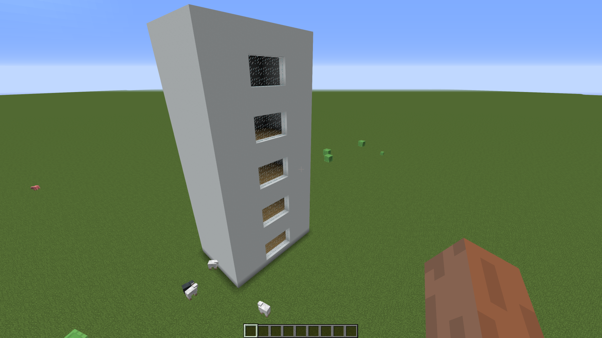

# Basic Skyscraper

With the help of programming we can build entire cities with ease. Writing a program to build structures is a great way to minimize repetitive work while experimenting with different parameters. If you are making a small house odds are that writing a program is inefficient and manually building it will get the job done much faster. However, if you are trying to build a skyscraper which spawns 20 stories high then manually it could take several hours depending on your speed but it will definitely be very boring. Writing code to do the same will take a dozen minutes with the added advantage that making changes will be extremely easy.

To get there first we will start small. In this tutorial we will learn how to build a simple skyscraper.

Our first task is to decide the dimensions and the parameters. Then think of a strategy/algorithm which will do the construction.

* Decide the location for the building
    `p = getPos() .+ (0, -1, 0)`
* Decide the dimensions and parameters for the building
    - floors = 5
    - length = 10
    - width = 15
    - height = 6
* Write the pseudo-code/algorithm
    Pseudo-code means to write informal code rather than _actual_ code which a human can understand. It can be helpful in designing algorithms this way.

        x = start_position
        for i in 1:floors
            buildFloor(x)
            increment x's height by floor's height
        end
        Build a ceiling for the top floor

        Now to build a floor
           1) Make all the walls out of glass panes
           2) Set the bottom level as the flooring block. (Cobblestone for instance)
           3) Add pillars to the corners

```julia
function buildFloor(p)
    # Set all walls to glass panes
    setBlocks(p .+ (1, 0, 1), p .+ (1, height, width), PiCraft.GLASS_PANE)
    setBlocks(p .+ (1, 0, 1), p .+ (length, height, 1), PiCraft.GLASS_PANE)
    setBlocks(p .+ (1, height, width), p .+(length, 0, width), PiCraft.GLASS_PANE)
    setBlocks(p .+ (length, height, width), p .+ (length, 0, 1), PiCraft.GLASS_PANE)

    #Set entire floor to Stone Brick
    setBlocks(p .+ (1, 0, 1), p .+ (length, 0, width), PiCraft.STONE_BRICK)

    #Set 4 Pillars to the corners
    setBlocks(p .+ (1, 0, 1), p .+ (1, height, 1), PiCraft.STONE_BRICK)
    setBlocks(p .+ (1, 0, width), p .+ (1, height, width), PiCraft.STONE_BRICK)
    setBlocks(p .+ (length, 0, 1), p .+ (length, height, 1), PiCraft.STONE_BRICK)
    setBlocks(p .+ (length, 0 , width), p .+ (length, height, width), PiCraft.STONE_BRICK)
end

function makeSkyscraper()
    for i in 1:floors
        buildFloor(p .+ (0, height*i - height, 0))
    end
    setBlocks(p .+ (1, height*floors, 1), p .+ (length, height*floors, width), PiCraft.IRON_BLOCK) # Set Roof to Iron Block
end
```

Executing `makeSkyscraper()` once will construct a building in front of you. Try experimenting around with different dimensions.


---


***

This building serves as a demonstration of how we can break down a construction task. When programming we will generally have a choice of algorithms/strategies to choose among. In our next example we will choose a different algorithm.

* Decide the location, parameters and dimensions like last time.
    -  `p = getPos() .+ (0, -1, 0)`
    - floors = 5
    - length = 10
    - width = 15
    - height = 6
* Pseudocode
    - Place a cuboid of blocks on the building space
    - Hollow out the inside
    - For each floor
        - Add flooring
        - Add windows

```julia
function makeSkyscraper2()
    # Make a filled cuboid of Blocks filling the entire building space
    setBlocks(p .+ (1, 0, 1), p .+ (length, height*floors + 1, width), Block(251, 0))

    # Hollow out the inside of the building
    setBlocks(p .+ (2, 1, 2), p .+ (length - 1, height*floors, width - 1), PiCraft.AIR)

    # Add wooden flooring
    for i in 0:floors
        setBlocks(p .+ (2, height*i, 2), p .+ (length - 1, height*i, width - 1), PiCraft.WOOD_PLANKS)
    end
    # Add window Panes, careful when changing building dimensions
    for i in 0:(floors - 1)
        setBlocks(p .+ (1, height*i + 2, floor.((width + 1)/2 - 2)),
        p .+ (1, height*i + 4, floor.((width + 1)/2 + 2)), PiCraft.GLASS_PANE)
        setBlocks(p .+ (1, height*i + 2, floor.((width + 1)/2 - 2)),
        p .+ (1, height*i + 4, floor.((width + 1)/2 + 2)), PiCraft.GLASS_PANE)
    end
end
```



---

To get better at building you should practice and try new structures and dimensions. Make your building beautiful by experimenting with a variety of different colored blocks and parameters. You can find a list of challenges below.

1) Make the building well lit with torches
2) Add a balcony to each floor.
3) A common ladder access for all floors.
4) Add randomness to your design
   Hint: for all blocks in building if block is cobblestone and rand() < 0.1 set block to Mossy Cobblestone
5) Try constructing a building with the "setback" design in mind. Given below is a documentary on how the setback principle came about.

[](http://www.youtube.com/watch?v=lGroIrQmwyw)
