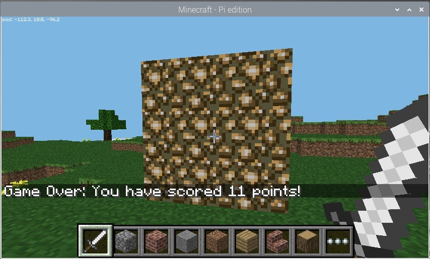

# Create a "Whac-a-Block" game in Minecraft from Julia using PiCraft.jl

Hello everyone! If you are reading this, you’re probably wondering how you can create a game using [PiCraft.jl](https://github.com/JuliaBerry/PiCraft.jl).
Well, that's what we're going to be doing today! Our game is called "Whac-a-Block" and is inspired by the classic arcade game ["Whac-a-Mole"](http://en.wikipedia.org/wiki/Whac-A-Mole).

The objective of this game is quite simple: it's simply to whack the blocks that light up as glowstone with a sword, and turn them back to stone. You will earn points for each block you turn back to stone! The game is over when all the blocks have been turned into glowstone.


**Check out [this YouTube video](https://youtu.be/WaqCf9CVsfY) for a quick demonstration of the game!**

This tutorial will be split into 7 parts:
- Installing Julia, RaspberryJamMod, and Setting up PiCraft.jl
- Creating the program and making sure that everything's working
- Building the game board
- Turning the blocks on
- Creating the "whacking" functionality
- Adding Game Over!
- Optional: Adding the option to change difficulty

## Step 1: Installing Julia, RaspberryJamMod, and Setting up PiCraft.jl

PiCraft is a Julia package which utilizes the Minecraft: Pi edition programming API to control the Minecraft World. The package can be used with Minecraft: Java Edition with the help of `RaspberryJamMod` & `RaspberryJuice` plugins.

### Minecraft: Java edition users

Follow the Julia installation instructions [here](https://julialang.org/downloads/platform/) for more details.

If you need help with installing Minecraft, please check out [https://www.minecraft.net/en-us/download/alternative].

**Get RaspberryJuice or RaspberryJamMod**

Officially the ability to communicate with the Minecraft world is only available for the Minecraft: Pi edition. To get this to work on the Java edition we need to install a Mod.

- "RaspberryJamMod" is a Forge Mod, if you wish to use this along with other Forge mods then this is recommended. Installation instructions are available [here](http://www.instructables.com/id/Python-coding-for-Minecraft/).
- "RaspberryJuice" is a Bukkit server plugin, recommended if you wish to work on a Bukkit Minecraft server. Get it [here](https://dev.bukkit.org/projects/raspberryjuice).

For more information on how you can do so, please click [here](https://juliaberry.github.io/PiCraft.jl/installation/).

### Minecraft: Pi edition / Raspberry Pi users
First, grab your Raspberry Pi. Turn it on and open Terminal. Once you're there, type the following:
```
sudo apt install julia
```
This should grab you the version 1.0.3, which is enough for this case. (I know it isn't the latest version!)

The Minecraft: Pi edition is pre-installed on all Rasbian since September 2014. Launch it by navigating to Menu > Games or typing minecraft-pi in the terminal.

### Adding PiCraft.jl

Type ```julia``` in your Terminal to enter Julia if you haven't already. Then type the following to add the package:

```julia
using Pkg
Pkg.add("https://github.com/JuliaBerry/PiCraft.jl")
```

## Step 2: Connecting PiCraft.jl to Minecraft & Creating the program
Congrats on completing step 1! Now, you can load the package you just added by entering the following in Julia:

```julia
using PiCraft
```

If you get an error saying ```"Unable to connect to minecraft world"``` then Minecraft may not be running. You need to be inside a World to the launch screen/menu. Otherwise, check whether RaspberryJamMod was correctly installed.

If you are still having trouble, or want to connect to a instance running on another computer running on your network, please check out the instructions [here](https://juliaberry.github.io/PiCraft.jl/connecting/) for more details.

To test, first connect using the ```connectToWorld(address, port = 4711)``` function. Then, enter ```post("Hello World")``` in the julia terminal. You should see ```"Hello World"``` displayed in the minecraft chat if everything's working properly.

Now, you can go the the directory you would like to save the program and open a new Julia file called `whack.jl`. Make sure it is saved properly. Then, you may enter `post("Welcome to Minecraft Whac-a-Block")` and see the following result:


## Step 3: Building the game board

The next step is to create the game board consisting of 3x3 stone blocks, which will randomly turn into glowstone and light up.

We are going to create the board right in front of the player's current position. First, we need to go the tile they're on (ie. their position), let's do that using `getTile()`. This returns the tuple containing the coordinates of the block the player's on.

```julia
tile = getTile()
```

Then we can use the `setBlocks()` function to create the game board out of stone.

```julia
setBlocks(tile .+ (-1, 0, 3), tile .+ (1, 2, 3), Block(1))
```


From now on, please wrap everything we do with a function called `main()` and call it when you run it. This is important because of how the scoping works in Julia with different variables. See [this Discourse thread](https://discourse.julialang.org/t/confused-about-global-vs-local-scoping-in-for-loops-in-1-0/16318/7) for more details.

You can let the user know that the game is about to start by posting a couple of messages to the chat and delay them using the `sleep()` function.

```julia
post("Get ready...")
sleep(2)
post("Go!")
```

When you run the program again, you should see the game board appear directly in front of the player and the messages you sent out.

## Step 4: Turning the blocks on

Now, we'll be creating the section that turns the stone blocks to glowstone and turn them on, by using  the `random()` function to pick a random block on the gameboard to turn on.

Let's create a variable called `blocksLit`, which will hold the number of blocks that are currently on (ie. became glowstone). Then, create another variable called `points` to store how many points the player has scored, which will be printed out at the game of the game. For now, let's set them both to 0.

```julia
blocksLit = 0
points = 0
```

Your program will need to loop until the game is over (ie. in this case, until all the blocks are lit).

For this, we'll create a while loop which will continue until the `blocksLit` variable is 9 (when all the blocks are lit). We can put a small delay so that the game won't run too fast that no one will be able to "whack" anything!

```julia
while blocksList < 9
  sleep(0.2)
```

Notice how there isn't an `end` to the loop. That's because it's not done yet. The code below will continue to be part of the while loop.

Now, we need to randomly turn a block into glowstone. We need to implement this in such a way that allows it to cope with situations such as whether the block you randomly chose is already on as glowstone. Here, we'll be using a method that creates a random position first, then check to see whether that block is stone. If it isn't stone (meaning that it's glowstone), it'll try to find a new position randomly again, and will do this continously until there's an unlit block.

First, create a variable called `lightCreated` then set it to `false`. Then, create a while loop that continues until `lightCreate`d is set to `true`. You can also increase the number of `blocksLit` by 1, to show that another block will be lit:

```julia
  blocksLit = blocksLit + 1
  lightCreated = false
  while !(lightCreated)
```

Now, once there's a block that has turned to glowstone, `lightCreated` will be set to `true` and the loop will exit. However, this isn't done yet, as we need to fill in the rest of the loop.

```julia
      xpos = tile[1] + randn(-1:1)
      ypos = tile[2] + randn(0:2)
      zpos = tile[3] + 3
```


Use `getBlock(x,y,z)` and an if statement to check if the block at the random position is stone. If it is, set it to glowstone using `setBlock(x,y,z,blockId)` and make `lightCreated = true`; if this is not changed, the code will go back to the start of the loop and find another random position.

```julia
      if getBlock(xpos, ypos, zpos) == Block(1,0)
        setBlock(xpos, ypos, zpos, Block(89,0)
        lightCreated = true
      end
   end
end
```
Now you can run the program again. This time you should see the board appearing and gradually the stone blocks turning into glowstone one by one until all nine are lit.

## Step 5: Adding the "whacking" functionality


Now, we would like to know whether the player has "whacked" a block or not. Luckily, PiCraft.jl has a function that allows you to find out what blocks have been hit. These are called Hit Events and can be found out using the `pollBlockHits()` function, which returns an array of these events. Each event is described by a tuple `((x, y, z), face, entityId)` and the `x,y,z` values describe the position of the block that got hit.

What we are trying to achieve here is to find out the position of the block that was hit before checking whether the block hit was glowstone using `getBlock`. If it was hit, then you can turn it back to stone using `setBlock` to reteduce the number of blocks lit and increase the number of points.

So, in your outer while loop starting with `while blocksLit < 9`, add the following `for` loop after `sleep(0.2)`:

```julia
      for block in pollBlockHits()
```

This iterates through all the blocks that had a Hit event and will do the following to them. We can use `getBlock` and the `block` data from `pollBlockHits()` to see if the block hit was glowstone using an `if` statement. Then, using `setBlock` to change it back to stone and decreasing `blocksLit` by 1 and increasing `points` by 1:

```julia
          if getBlock((block[1][1], block[1][2], block[1][3])) == Block(89, 0)
              setBlock((block[1][1], block[1][2], block[1][3]), Block(1, 0))
              blocksLit = blocksLit - 1
              points = points + 1
          end
      end
```

Now, if you run it again, you should see the board appearing and the blocks lighting up like last time. But in addition, you should also see them turning back to stone if you hit them with a sword by **right-clicking**!

## Step 6: Game Over & Finishing Off

Now, you can let everyone know that the game is over (when all 9 blocks are lit) and tell the player how many points they have scored (how many glowstone they turned back into stone). Place the following underneath the outer `while` loop starting with `while blocksLit < 9`.

```julia
post("Game Over: You have scored ", string(points), " points!")
```



**Congratulations!**

Your final code should look like something along the lines with the following:

```julia
using PiCraft

post("Welcome to Minecraft Whac-a-Block") 

tile = getTile()

setBlocks(tile .+ (-1, 0, 3), tile .+ (1, 2, 3), Block(1))

function main()
    post("Get ready...")
    sleep(2)
    post("Go!")
    blocksLit = 0
    points = 0
    while blocksLit < 9
    
        sleep(0.2)
        
        for block in pollBlockHits()
            if getBlock((block[1][1], block[1][2], block[1][3])) == Block(89, 0)
                setBlock((block[1][1], block[1][2], block[1][3]), Block(1, 0))
                blocksLit = blocksLit - 1
                points = points + 1
            end
        end
        
        blocksLit = blocksLit + 1
        lightCreated = false
        while !(lightCreated)
            xpos = tile[1] + rand(-1:1)
            ypos = tile[2] + rand(0:2)
            zpos = tile[3] + 3
            if getBlock((xpos, ypos, zpos)) == Block(1,0)
                setBlock((xpos, ypos, zpos), Block(89, 0))
                lightCreated = true
            end
        end
    end
    post("Game Over: You have scored ", string(points), " points!")
end

main()
```

## Optional: Adding the option to change difficulty

You can alter the difficult of the game by changing how long the program waits before lighting up another stone block into glowstone. Currently it is `sleep(0.2)` so it's 0.2 seconds. You can decrease that to make the game harder and increase it to make it easier.

We can create 10 difficulty levels. 10 being the hardest with a 0.1-second interval, and 1 being lowest with a 1-second interval.
We can do this by creating a function that asks the user for the difficulty level, analyses it to turn into the interval we want in seconds, which will be the argument for the `sleep()` function.

```julia
function difficulty()
    println("Enter difficulty (1-10)")
    diff = 1.1 - (parse(Int64, readline()) / 10)
    println("Please return to Minecraft!")
    return diff
end
```

Then, all we have to do is call this function in the `main()` function where everything else is in.
Create a variable called `level` to call this function and have the analysed value put in:

```julia
level = difficulty()
```

Then change the `sleep(0.2)` in the outer while loop starting with `while blocksLit < 9` to the following:

```julia
sleep(level)
```

**Final Code**:

```julia
using PiCraft

post("Welcome to Minecraft Whac-a-Block") 

tile = getTile()

setBlocks(tile .+ (-1, 0, 3), tile .+ (1, 2, 3), Block(1))

function difficulty()
    println("Enter difficulty (1-10)")
    diff = 1.1 - (parse(Int64, readline()) / 10)
    println("Please return to Minecraft!")
    return diff
end
    

function main()
    level = difficulty()
    post("Get ready...")
    sleep(2)
    post("Go!")
    blocksLit = 0
    points = 0
    while blocksLit < 9
    
        sleep(level)
        
        for block in pollBlockHits()
            if getBlock((block[1][1], block[1][2], block[1][3])) == Block(89, 0)
                setBlock((block[1][1], block[1][2], block[1][3]), Block(1, 0))
                blocksLit = blocksLit - 1
                points = points + 1
            end
        end
        
        blocksLit = blocksLit + 1
        lightCreated = false
        while !(lightCreated)
            xpos = tile[1] + rand(-1:1)
            ypos = tile[2] + rand(0:2)
            zpos = tile[3] + 3
            if getBlock((xpos, ypos, zpos)) == Block(1,0)
                setBlock((xpos, ypos, zpos), Block(89, 0))
                lightCreated = true
            end
        end
    end
    post("Game Over: You have scored ", string(points), " points!")
end

main()
```

Now you're all set! Thanks for reading!

### written by kfung

### Reference:
Some images are from the [Whac-A-Block Game worksheet on raspberrypi.org](https://www.raspberrypi.org/learning/minecraft-whac-a-block-game/worksheet/) under CC BY-SA.
